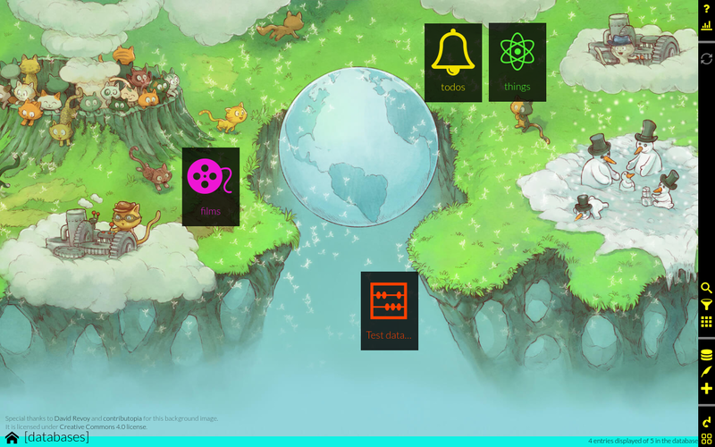

<!--
N.B.: This README was automatically generated by https://github.com/YunoHost/apps/tree/master/tools/README-generator
It shall NOT be edited by hand.
-->

# Dato for YunoHost

[](https://dash.yunohost.org/appci/app/dato)    
[](https://install-app.yunohost.org/?app=dato)

*[Lire ce readme en français.](./README_fr.md)*

> *This package allows you to install Dato quickly and simply on a YunoHost server.
If you don't have YunoHost, please consult [the guide](https://yunohost.org/#/install) to learn how to install it.*

## Overview

Dato is an application that make it easy to generate and modify any type of database entries with a nice UI/UX.

With it, you can create and handle any amount of databases, choose and setup what type of entries to put in them and customize yourself the UI that will let you edit databases entries.

You can think of dato as an app that can replace: address book apps, todo list apps, table sheets to store lists of things... because it's flexible enough to do all these the way you want it to be done.

The purpose of dato is not to propose a UI specific to some purpose, but something as customizable as possible, so that you can in a few minutes setup any kind of database. However, if you want a more specialized interface to improve the UX for your needs, you can create plugins to extend the default general functionalities.

Dato is a progressive webapp, which means that you can install it from the browser in computer and phones, and use it offline.


**Shipped version:** 1.6.3~ynh3

**Demo:** https://publicdato.eauchat.org/

## Screenshots



## Disclaimers / important information

* Any known limitations, constrains or stuff not working, such as (but not limited to):
    * For now, dato needs a full domain, it doesn't support being set to a subpath.
    * LDAP is not supported, but dato has it's own user's control system, so it can be used publicly, or restricted to some users when autosynchronization is enabled.

## Configuration

To configure dato, you can edit the `config/public.js` file in the app directory that should be in `/opt/yunohost/APPID/` where `APPID` is `dato` if it's the first installed instance, `dato__2`, `dato__3`... for additional instances.
You can also make modifications in `config/private.js`, but be sure to know what you're doing when doing so.


## Autosynchronization

By default all data you create with dato is stored only in your browser. Users can manually enable per-database synchronization with any remote couch server, but this process is not obvious to users. Therefore dato provide an autosynchronization mechanism.
To enable it, you need to setup a couchdb server (you can do this using the [couchdb yunohost package](https://github.com/YunoHost-Apps/couchdb_ynh)). You should do this before installing dato.
Then when installing dato, set the url to your couchdb server when prompted (you will also need to fill your couchdb admin password, and info about the dato admin user to create). Dato will automatically setup the dato administrator account in your couchdb server. You can then easily add users from the user interface, as specified below.

If you want to allow both a free usage of the app by anyone, and autosynchronization for some users, you can install the dato package multiple times with different setups.


## Adding users

If you setup autosynchronization, users will need an account to use the app. Dato doesn't support LDAP for the moment, so you will need to add users in it's own database.
To add a user to dato, just visit the `/users/` page (e.g. https://dato.yourdomain.tld/users/), create a new user, then don't forget to click on "roles" under the user's name, and add the role `dato`.
If you want a user to have administration rights (= to have the power to add/remove users) you can give that user the `dato-admin` role.

Also, if you need, you can make use of the password reset feature to allow users to modify their passwords, you will just need to send them the generated password reset link.


## A note about dato

Please be aware that dato is a Progressive Web App. In a nutshell, this means that browsers cache the whole app, so it doesn't have to be requested to the server every time a user is visiting it.
This lowers solicitation of the server, and also allow users to use dato offline.

When the app is upgraded, the user's browser will automatically detect that there is a new version, and propose to reload the page to update. However, sometimes it seems a bit random how browsers notice the new version, so if you want to make sure you're using the latest version, click on the "?" button (top-right in the web interface), and choose "credits" to verify the version you're using.
You can also force reloading the app from the server opening "about:serviceworkers" in your browser and unregistering the worker for the domain in which you installed dato.

## Documentation and resources

* Official admin documentation: <https://squeak.eauchat.org/dato/>
* Upstream app code repository: <https://framagit.org/squeak/dato>
* YunoHost documentation for this app: <https://yunohost.org/app_dato>
* Report a bug: <https://github.com/YunoHost-Apps/dato_ynh/issues>

## Developer info

Please send your pull request to the [testing branch](https://github.com/YunoHost-Apps/dato_ynh/tree/testing).

To try the testing branch, please proceed like that.

``` bash
sudo yunohost app install https://github.com/YunoHost-Apps/dato_ynh/tree/testing --debug
or
sudo yunohost app upgrade dato -u https://github.com/YunoHost-Apps/dato_ynh/tree/testing --debug
```

**More info regarding app packaging:** <https://yunohost.org/packaging_apps>
