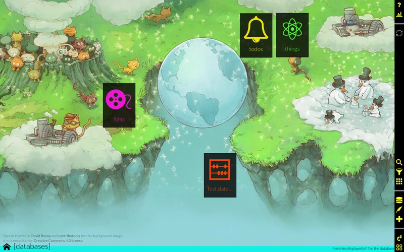

<!--
Este archivo README esta generado automaticamente<https://github.com/YunoHost/apps/tree/master/tools/readme_generator>
No se debe editar a mano.
-->

# Dato para Yunohost

[](https://dash.yunohost.org/appci/app/dato)  

[](https://install-app.yunohost.org/?app=dato)

*[Leer este README en otros idiomas.](./ALL_README.md)*

> *Este paquete le permite instalarDato rapidamente y simplement en un servidor YunoHost.*  
> *Si no tiene YunoHost, visita [the guide](https://yunohost.org/install) para aprender como instalarla.*

## Descripción general

Dato is an application that make it easy to generate and modify any type of database entries with a nice UI/UX.

With it, you can create and handle any amount of databases, choose and setup what type of entries to put in them and customize yourself the UI that will let you edit databases entries.

You can think of dato as an app that can replace: address book apps, todo list apps, table sheets to store lists of things... because it's flexible enough to do all these the way you want it to be done.

The purpose of dato is not to propose a UI specific to some purpose, but something as customizable as possible, so that you can in a few minutes setup any kind of database. However, if you want a more specialized interface to improve the UX for your needs, you can create plugins to extend the default general functionalities.

Dato is a progressive webapp, which means that you can install it from the browser in computer and phones, and use it offline.


**Versión actual:** 1.7.2~ynh1

**Demo:** <https://publicdato.eauchat.org/>

## Capturas



## Documentaciones y recursos

- Sitio web oficial: <https://squeak.eauchat.org/dato>
- Documentación administrador oficial: <https://squeak.eauchat.org/dato/>
- Repositorio del código fuente oficial de la aplicación : <https://framagit.org/squeak/dato>
- Catálogo YunoHost: <https://apps.yunohost.org/app/dato>
- Reportar un error: <https://github.com/YunoHost-Apps/dato_ynh/issues>

## Información para desarrolladores

Por favor enviar sus correcciones a la [`branch testing`](https://github.com/YunoHost-Apps/dato_ynh/tree/testing

Para probar la rama `testing`, sigue asÍ:

```bash
sudo yunohost app install https://github.com/YunoHost-Apps/dato_ynh/tree/testing --debug
o
sudo yunohost app upgrade dato -u https://github.com/YunoHost-Apps/dato_ynh/tree/testing --debug
```

**Mas informaciones sobre el empaquetado de aplicaciones:** <https://yunohost.org/packaging_apps>
