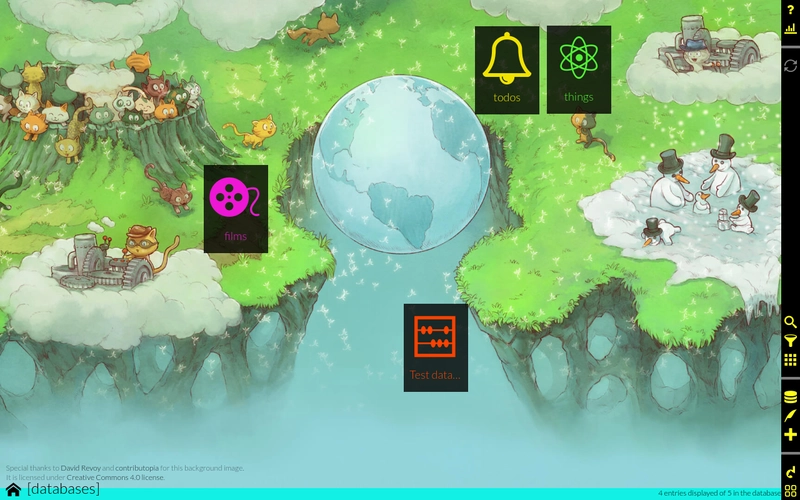

<!--
NOTA: Este README foi creado automáticamente por <https://github.com/YunoHost/apps/tree/master/tools/readme_generator>
NON debe editarse manualmente.
-->

# Dato para YunoHost

[](https://dash.yunohost.org/appci/app/dato)  

[](https://install-app.yunohost.org/?app=dato)

*[Le este README en outros idiomas.](./ALL_README.md)*

> *Este paquete permíteche instalar Dato de xeito rápido e doado nun servidor YunoHost.*  
> *Se non usas YunoHost, le a [documentación](https://yunohost.org/install) para saber como instalalo.*

## Vista xeral

Dato is an application that make it easy to generate and modify any type of database entries with a nice UI/UX.

With it, you can create and handle any amount of databases, choose and setup what type of entries to put in them and customize yourself the UI that will let you edit databases entries.

You can think of dato as an app that can replace: address book apps, todo list apps, table sheets to store lists of things... because it's flexible enough to do all these the way you want it to be done.

The purpose of dato is not to propose a UI specific to some purpose, but something as customizable as possible, so that you can in a few minutes setup any kind of database. However, if you want a more specialized interface to improve the UX for your needs, you can create plugins to extend the default general functionalities.

Dato is a progressive webapp, which means that you can install it from the browser in computer and phones, and use it offline.


**Versión proporcionada:** 1.7.1~ynh1

**Demo:** <https://publicdato.eauchat.org/>

## Capturas de pantalla



## Documentación e recursos

- Web oficial da app: <https://squeak.eauchat.org/dato>
- Documentación oficial para admin: <https://squeak.eauchat.org/dato/>
- Repositorio de orixe do código: <https://framagit.org/squeak/dato>
- Tenda YunoHost: <https://apps.yunohost.org/app/dato>
- Informar dun problema: <https://github.com/YunoHost-Apps/dato_ynh/issues>

## Info de desenvolvemento

Envía a túa colaboración á [rama `testing`](https://github.com/YunoHost-Apps/dato_ynh/tree/testing).

Para probar a rama `testing`, procede deste xeito:

```bash
sudo yunohost app install https://github.com/YunoHost-Apps/dato_ynh/tree/testing --debug
ou
sudo yunohost app upgrade dato -u https://github.com/YunoHost-Apps/dato_ynh/tree/testing --debug
```

**Máis info sobre o empaquetado da app:** <https://yunohost.org/packaging_apps>
